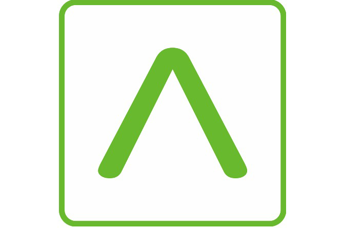

<p align="center">
  
</p>

<h1 align="center">Ameria Bank MCP Server</h1>

<p align="center">
  <a href="https://opensource.org/licenses/MIT"></a>
  
</p>

> **Unofficial.** This project is not affiliated with, endorsed by, or associated with Ameria Bank. It is an independent open-source tool that uses the publicly accessible MyAmeria online banking interface.

Open-source MCP server for [Ameria Bank](https://myameria.am) online banking. Query your transaction history, account balances, and card info — all through AI assistants like Claude Desktop.

> **Read-only.** This server only reads data from your accounts. It cannot initiate transfers, payments, or modify anything.

## Available Tools

| Tool | Description |
|------|-------------|
| `get_transactions` | Transaction history with date range and pagination |
| `search_transactions` | Search transactions by merchant/keyword |
| `get_accounts_and_cards` | All accounts, cards, balances, overdraft info |
| `get_available_balance` | Detailed balance breakdown for a specific card/account |
| `get_account_events` | Per-account transaction events with filtering |

## Setup

### 1. Get Your Refresh Token

The server uses a **refresh token** to automatically obtain short-lived access tokens. You only need to set this up once — the refresh token is long-lived and the server handles token rotation automatically.

1. Log in to [MyAmeria](https://myameria.am)
2. Open browser Developer Tools (F12 or Cmd+Option+I)
3. Go to the **Network** tab, filter by `token`
4. Look for a request to `account.myameria.am/auth/realms/ameria/protocol/openid-connect/token`
5. In the response, copy the `refresh_token` value
6. Store it in a secure vault (1Password, macOS Keychain, etc.)

> **Note:** The refresh token lasts much longer than the 15-minute access token. The server automatically refreshes the access token when it expires, so you don't need to manually update tokens for each session.

### 2. Configure Claude Desktop

Add to `~/Library/Application Support/Claude/claude_desktop_config.json` (macOS) or `%APPDATA%\Claude\claude_desktop_config.json` (Windows):

**Option A — Vault (recommended, token auto-rotates):**
```json
{
  "mcpServers": {
    "ameria-bank": {
      "command": "node",
      "args": ["/absolute/path/to/ameria-mcp/server.js"],
      "env": {
        "AMERIA_VAULT": "keychain",
        "AMERIA_VAULT_KEY": "ameria-mcp"
      }
    }
  }
}
```

**Option B — Env var (simpler, but tokens don't persist across rotations):**
```json
{
  "mcpServers": {
    "ameria-bank": {
      "command": "node",
      "args": ["/absolute/path/to/ameria-mcp/server.js"],
      "env": {
        "AMERIA_TOKEN": "your_refresh_token"
      }
    }
  }
}
```

Restart Claude Desktop after saving.

## Usage Examples

Once connected, you can ask Claude things like:

- "Show my recent transactions"
- "How much did I spend on Yandex Go this month?"
- "What are my card balances?"
- "Show me all transactions over 10,000 AMD last week"
- "What's my available balance on the Visa Signature card?"
- "List all spending on groceries this month"

## Environment Variables

| Variable | Required | Description |
|----------|----------|-------------|
| `AMERIA_TOKEN` | Yes* | Refresh token from MyAmeria. *Not required if using a vault. |
| `AMERIA_CLIENT_AUTH` | Yes* | Base64-encoded `client_id:client_secret` for the token endpoint. *Not required if using a vault. |
| `AMERIA_CLIENT_ID` | Yes* | Client-Id header value for API calls. *Not required if using a vault. |
| `AMERIA_VAULT` | No | Vault backend: `1password` or `keychain` |
| `AMERIA_VAULT_KEY` | No | Item name in the vault (e.g. `ameria-mcp`) |

### Vault Integration (Recommended)

Store the refresh token in a vault instead of an env var. The server reads from the vault on startup and **automatically saves rotated refresh tokens back** — so you never have to manually update the token again.

#### 1Password

Requires the [1Password CLI](https://developer.1password.com/docs/cli/) (`op`) with biometric unlock or service account.

1. Create an item called `ameria-mcp` in 1Password
2. Add these fields:
   - `refresh_token` — your refresh token
   - `client_auth` — Base64-encoded `client_id:client_secret` (from the Authorization header in the token request)
   - `client_id` — the Client-Id UUID (from the API request headers)
3. Configure Claude Desktop:

```json
{
  "mcpServers": {
    "ameria-bank": {
      "command": "node",
      "args": ["/absolute/path/to/ameria-mcp/server.js"],
      "env": {
        "AMERIA_VAULT": "1password",
        "AMERIA_VAULT_KEY": "ameria-mcp"
      }
    }
  }
}
```

The server reads `refresh_token`, `client_auth`, and `client_id` from the item via `op item get` and writes back rotated refresh tokens with `op item edit`.

#### macOS Keychain

1. Store the credentials:
```bash
security add-generic-password -s ameria-mcp -a refresh_token -w "YOUR_REFRESH_TOKEN" -U
security add-generic-password -s ameria-mcp -a client_auth -w "YOUR_BASE64_CLIENT_AUTH" -U
security add-generic-password -s ameria-mcp -a client_id -w "YOUR_CLIENT_ID_UUID" -U
```

2. Configure Claude Desktop:

```json
{
  "mcpServers": {
    "ameria-bank": {
      "command": "node",
      "args": ["/absolute/path/to/ameria-mcp/server.js"],
      "env": {
        "AMERIA_VAULT": "keychain",
        "AMERIA_VAULT_KEY": "ameria-mcp"
      }
    }
  }
}
```

The server reads `refresh_token`, `client_auth`, and `client_id` from Keychain (service=`ameria-mcp`) and writes back rotated refresh tokens automatically.

#### No Vault (env only)

If `AMERIA_VAULT` is not set, the server uses `AMERIA_TOKEN` env var directly. Rotated tokens are kept in memory only and not persisted — you'll need to update the token manually if the refresh token expires.

## Development

```bash
git clone <repo-url>
cd ameria-mcp
npm install
```

Run locally:

```bash
AMERIA_TOKEN=your_token node server.js
```

Test with MCP Inspector:

```bash
AMERIA_TOKEN=your_token npm run inspect
```

### Running Tests

```bash
npm test
```

104 tests covering all helper functions: date validation, card/account masking, currency grouping, transaction formatting, and error handling.

### Claude Code

```bash
claude mcp add ameria-bank -- node /absolute/path/to/ameria-mcp/server.js
```

Then set `AMERIA_TOKEN` in your environment.

## Security

- **Read-only** — no write operations, no transfers, no payments
- **Access tokens auto-refresh** — the server uses a refresh token to obtain short-lived access tokens automatically
- **Card numbers are masked** — double-masked even though the API already partially masks them
- **30-second request timeout** — prevents indefinite hangs
- **No data persistence** — nothing is cached or stored locally

## License

MIT
